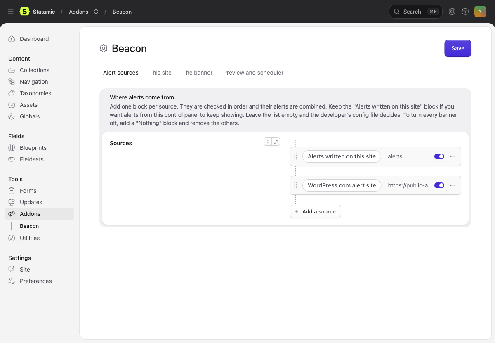

# How to set Beacon up

One guide per way alerts can reach the banner, plus one for whoever runs
the server. Each follows the same shape: what you need, the settings
screen, the same in the config file, how to test it, how it fails, and a
checklist for the people who will publish alerts.

Start with [operating.md](operating.md) if you are the developer or the
server owner. Start with the guide for your source if you are setting up
where alerts come from.

| Guide | For |
|---|---|
| [local-alerts.md](local-alerts.md) | Alerts written in this site's control panel |
| [wordpress.md](wordpress.md) | Joining a WordPress.com alert site, and setting one up |
| [rss-atom.md](rss-atom.md) | Any platform with an RSS or Atom feed |
| [weather-cap.md](weather-cap.md) | The National Weather Service and other CAP publishers |
| [github.md](github.md) | A file, a Gist, or labeled issues on GitHub |
| [json.md](json.md) | A JSON feed nobody has a guide for |
| [operating.md](operating.md) | The scheduler, audiences, preview, monitoring, static caching |

The settings screen is at Addons, Beacon, Settings in the control panel.

