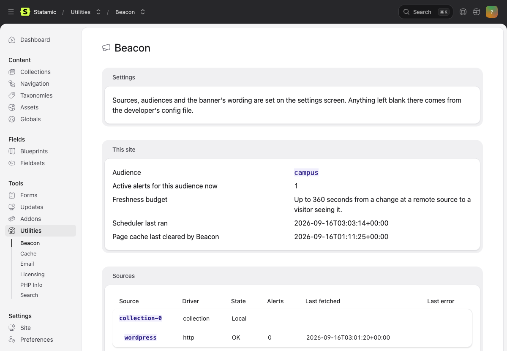

# Operating Beacon

For the developer or server owner. Everything here is about making sure
an alert that is published actually reaches a visitor, and that you find
out when it cannot.

## What you need

- Beacon installed (`composer require bpmore/statamic-beacon` and
  `php please beacon:install`).
- `{{ beacon }}` first inside `<body>` in the layout, before the skip
  link.
- Shell access to the server for the cron line, if any source is remote.

## The scheduler

Remote sources (anything but the local collection) are fetched by
Laravel's scheduler, never during a page view. Without it a remote alert
never arrives. The crontab line:

```
* * * * * cd /path/to/site && php artisan schedule:run >> /dev/null 2>&1
```

Beacon registers `beacon:tick` to run every minute. Each tick fetches
the sources whose poll interval has passed, notices alerts whose start
or end time just went by, and clears the page cache when either changed
what a visitor sees.

How you know it is running: the Beacon page under Tools shows
"Scheduler last ran" with a time under a minute old, and no warning box
at the top.

## The freshness budget

The longest a change at a remote source can take to reach a visitor is
the source's poll interval plus one minute (the scheduler's granularity).
With the default 300 seconds that is 6 minutes. The Beacon page shows
the number for your settings. Halve the poll interval and you halve the
wait; the cost is twice the requests to the source, which matters for
GitHub's issues API and not much else.

Local alerts are immediate on save, and their scheduled starts and ends
are honoured within a minute.

## Audiences

An audience is a name shared by a group of sites. On the settings
screen, This site tab, set this site's audience. Alerts aimed at that
name show here; alerts aimed at other names do not; alerts aimed at no
name show everywhere. Matching is exact: `campus` does not match
`campus-north`, and nothing is guessed from the hostname.

Multi-site installs: the "Audiences by site" table maps each Statamic
site to its audience. A site not in the table uses the default.

## Static caching

Beacon works behind Statamic's static cache in half and full mode. It
clears the whole cache (the banner is on every page) when:

- an alert entry is saved, published, unpublished or deleted
- a scheduled start or end passes
- a remote fetch returns different alerts from last time
- the settings screen is saved

It does not clear the cache when a fetch returns the same alerts, so
polling every five minutes costs nothing in cache hits.

Previews bypass the cache both ways.

## Live emergency updates

Off by default. On the settings screen, Preview and scheduler tab, "Show
new emergencies without a page load". A script on every page then asks
`/!/statamic-beacon/live` on this site every so often (60 seconds by
default, 15 at the fastest) and shows a new emergency on the page a
visitor already has open. It is only as fresh as the scheduler, because
the endpoint serves what the scheduler last stored; it never contacts a
remote source itself. Cost: one small same-origin request per open tab
per interval. Behind a static cache the endpoint is never cached.

## Monitoring

```
php please beacon:status
php please beacon:status --json | jq .healthy
```

Exit 0 when every remote source has a payload within its retention
ceiling and the scheduler has run recently. Exit 1 otherwise. Exit 2 if
the command itself failed. `--strict` also fails when a source's last
attempt failed even though its retained payload is still good. Point a
monitor at it.

The Beacon page under Tools shows the same per source: last fetch, last
error, retained alerts, backoff, and GitHub's remaining rate limit.



## When a source breaks

Nothing shows to visitors and nothing breaks the page. The last good
payload stays up until its alerts' end times pass or until it is older
than the source's retention ceiling (default 24 hours), after which
nothing from that source shows. A source that answers "no alerts" clears
its banner; a source that fails to answer does not.

## Preview

A signed-in user with the "View Beacon previews" permission (Users,
Roles) can open any page with `?beacon-preview=emergency`, `=warning` or
`=info` and see the newest alert, published or not, at that severity
with a preview marker. Anyone else sees the page as it is. Give this
permission to the people who publish alerts.

## Fetching by hand

```
php please beacon:fetch
```

Fetches every remote source now and clears the cache if anything
changed. Useful the first time, and on a machine with no scheduler.

## Checklist

- [ ] Cron line in place, "Scheduler last ran" under a minute old
- [ ] This site's audience set, and the site table if multi-site
- [ ] `beacon:status` exits 0
- [ ] Preview permission given to the publishers
- [ ] `{{ beacon }}` before the skip link (Tab from the address bar lands in the banner first)
