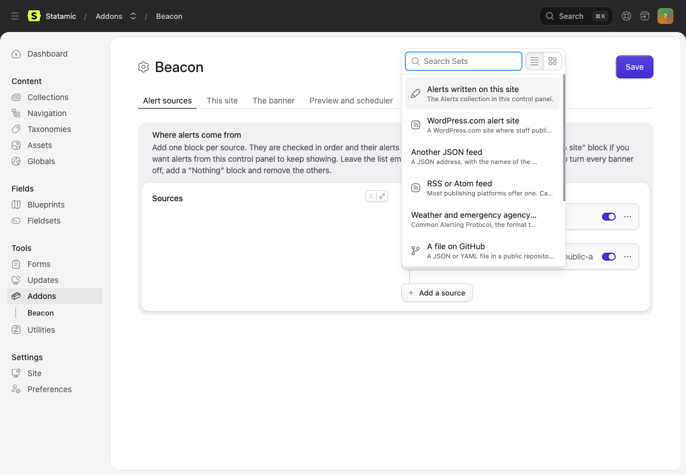
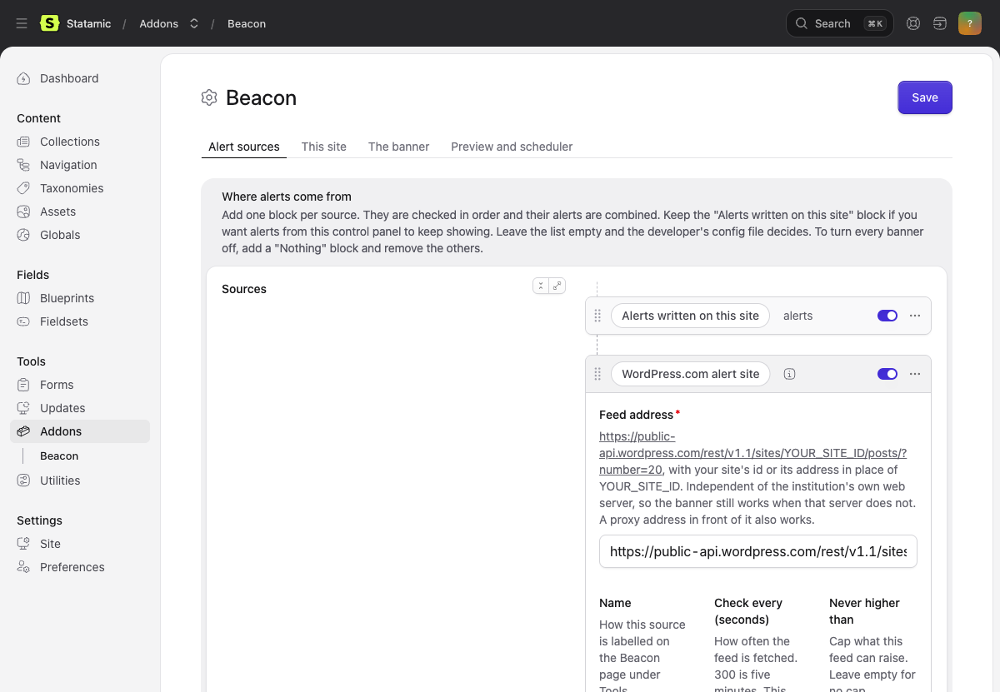
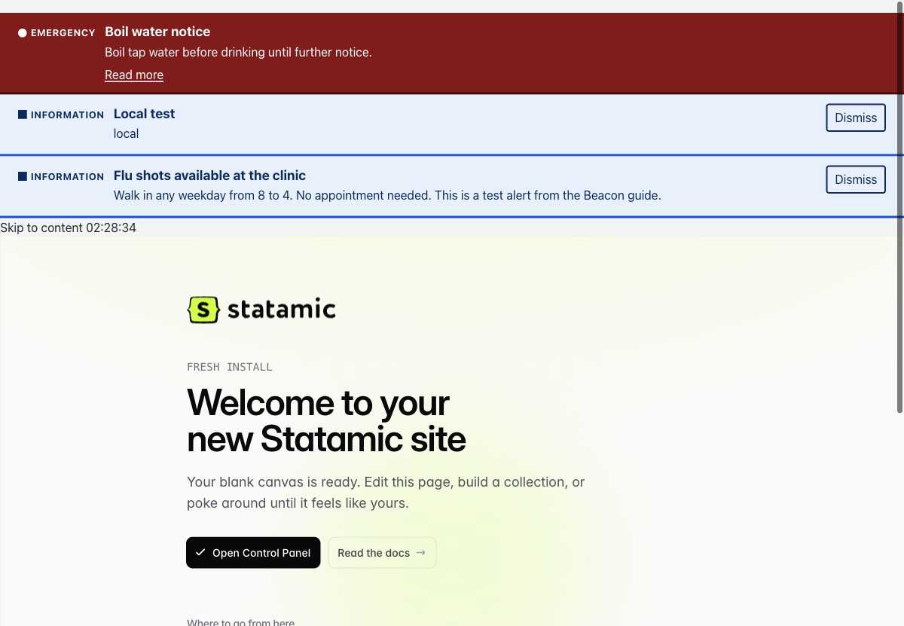

# WordPress as an alert source

Two halves. The first is for a site joining an alert system that already
runs on WordPress.com, and takes two minutes. The second is for anyone
standing that system up: a WordPress site that communications staff post
to, read by every site you run. What the feed looks like on the wire is
in [../reference/wordpress-alert-feed.md](../reference/wordpress-alert-feed.md).

## Part 1: point a site at an existing WordPress.com alert site

### What you need

- Beacon installed and the scheduler running
  ([operating.md](operating.md)).
- The alert site's WordPress.com address or numeric site id.
- To know which audience this site is (`campus`, `clinic`, and so on;
  whoever runs the alert site keeps the list).

### On the settings screen

Addons, Beacon, Settings.

1. **This site** tab: set "This site's audience" to your audience, for
   example `clinic`. Save.
2. **Alert sources** tab: click "Add a source" and choose "WordPress.com
   alert site".

   

3. Feed address:
   `https://public-api.wordpress.com/rest/v1.1/sites/YOUR_SITE_ID/posts/?number=20`
   with the alert site's id or address in place of `YOUR_SITE_ID`. This
   reads WordPress.com directly, which keeps working when the
   institution's own web server does not. Leave "Check every" at 300
   unless you have a reason.

   

4. Keep the "Alerts written on this site" block if you also want local
   alerts. Save.

### In the config file

```php
'audience' => 'clinic',
'sources' => [
    ['driver' => 'collection'],
    ['driver' => 'http', 'key' => 'wordpress',
     'url' => 'https://public-api.wordpress.com/rest/v1.1/sites/YOUR_SITE_ID/posts/?number=20',
     'poll' => 300],
],
```

The field map, severity words and emptiness rule default to WordPress.com's
shape, so nothing else is needed.

### Test it

```
php please beacon:fetch
```

Expect `wordpress ok N alert(s)`. N is how many posts on the alert site
carry a meaningful category right now; zero is normal on a quiet day.
The Beacon page under Tools shows the fetch time.

To see a banner without waiting for a real alert, a signed-in user with
the preview permission opens any page with `?beacon-preview=emergency`.

### How it fails

- **`FAILED ... Could not reach the source`**: WordPress.com is
  unreachable from the server. The last good alerts stay up for a day.
- **`ok 0 alert(s)` during a real alert**: the post's category is wrong
  or missing. It must be exactly `urgent-`, `alert-` or `fyi-` followed
  by an audience name.
- **Fetch works, banner missing**: the post's audience is not this
  site's. A post tagged `urgent-campus` does not show on a site whose
  audience is `clinic`. Or the scheduler is not running: check the
  Beacon page under Tools.

### Migrating a site off a script-tag client

1. Remove the old client's script tag and stylesheet link.
2. Remove the body class or data attribute the old client read. Beacon
   reads the audience from its settings.
3. Add `{{ beacon }}` first inside `<body>`.
4. If the site's stylesheet targets the old banner's ids and classes,
   turn on "Legacy class names" on the banner tab and set the prefix to
   whatever the old classes started with. Restyle `.beacon` at leisure
   and turn it off.
5. Set the audience and add the WordPress.com block as above.

What changes for visitors: the heading is an h2 not an h1, the banner
is a landmark and not a live region, links say what they lead to,
emergencies cannot be dismissed, nothing outside the banner moves.

## Part 2: run a WordPress site as an alert source

One WordPress site, posted to by a handful of people, read by every site
you run. It works because WordPress.com (or a self-hosted WordPress)
serves posts as JSON with no key.

### Why this model

- Communications staff already know WordPress. There is nothing new to
  learn at 2am.
- The source is independent of the sites that show the banner. If your
  main site is down, the alert about it still comes from somewhere else.
- Categories carry severity and audience, so one post can be an
  emergency on the clinical sites and information on the campus sites.

### Set up the site on WordPress.com

1. Create a site at wordpress.com. The free plan is enough. Pick a name
   that says what it is, such as `youruniversity-alerts`. Set it to
   public: the API only serves public sites without a key.
2. Note the site id. Open
   `https://public-api.wordpress.com/rest/v1.1/sites/YOURSITE.wordpress.com/`
   in a browser; the `ID` near the top is it. The address works in place
   of the id too.
3. Create the categories. One per severity per audience. Decide your
   audience names first (short, lowercase, letters and digits, exact),
   then make `urgent-NAME`, `alert-NAME` and `fyi-NAME` for each. For
   three audiences that is nine categories. Posts, Categories in
   wp-admin (`/wp-admin/edit-tags.php?taxonomy=category`): type the name
   exactly as the slug should read, such as `urgent-campus`, and click Add
   Category. WordPress makes the slug from the name, so a lowercase
   hyphenated name gives the right slug. Check the Slug column.
4. Give publishing rights to the people who will post alerts, and to
   nobody else. Two-factor on every account.
5. Turn comments off site-wide. Nobody needs to comment on an emergency.

### Publishing an alert

1. Posts, Add New. Title is the banner heading. Keep it short.
2. Body: the first paragraph is what shows in the banner. To show only
   that and link to the rest, press Enter after it, type `/html`, choose
   Custom HTML, click **Edit HTML** (the block shows a placeholder until
   you do), type `<!--noteaser-->`, click Update. Then click below the
   block and write the rest. Without the marker the whole body shows in
   the banner and there is no Read more link.
3. In the Post sidebar, open Categories and tick one per site that
   should show it, at the right severity. Typing in the search box
   narrows the list. WordPress drops "Uncategorized" by itself once you
   tick another.
4. Publish. In the panel that opens, under Newsletter, choose **Post
   only** unless you mean to email every subscriber the alert. Decide
   this once for the team and put it in the checklist. Then Publish
   again.
5. Within the poll interval plus a minute, every site with a matching
   audience shows it.

To end it, unpublish the post (Switch to draft) or delete it. To correct
it, edit and update; people who dismissed the old text see the new.

This was followed on a fresh free WordPress.com site on 2026-09-16:
three posts, one per severity, one with the marker. All three came
through, the marker split the teaser, and each consuming audience saw
only its own.



### Point Beacon at it

Part 1, with your site's id in the address. Set each consuming site's
audience to one of your audience names.

### Self-hosted WordPress instead

A self-hosted site serves posts at `/wp-json/wp/v2/posts`. The shape is
different: the title and body are under `rendered`, and categories
arrive as ids unless you ask for `_embed`. Use the "Another JSON feed"
block, or in the config file:

```php
['driver' => 'http', 'key' => 'alerts',
 'url' => 'https://alerts.example.edu/wp-json/wp/v2/posts?_embed=wp:term&per_page=20',
 'map' => [
     'root' => '',
     'id' => 'id',
     'title' => 'title.rendered',
     'body' => 'content.rendered',
     'url' => 'link',
     'starts_at' => 'date_gmt',
     'audiences' => ['from' => '_embedded.wp:term.*.*.slug',
                     'pattern' => '^(?<severity>urgent|alert|fyi)-(?<audience>[a-z0-9]+)$'],
 ],
 'severity_map' => ['urgent' => 'emergency', 'alert' => 'warning', 'fyi' => 'info'],
 'empty_when' => []],
```

On the "Another JSON feed" block the same values go in the fields:
list at (empty), id `id`, title `title.rendered`, body
`content.rendered`, link `link`, audiences `_embedded.wp:term.*.*.slug`,
tag pattern as above, and the three severity words in the table. Tags
work as well as categories; both arrive under `wp:term`.

Publishing is the same as on WordPress.com. A site behind a login or
with the REST API disabled will not work; the API must answer without a
cookie.

### How it fails

- **The API returns an error page**: the site is private, or a security
  plugin blocks the REST API. Beacon keeps the last good alerts and logs
  it.
- **Posts show as `general-information` only**: the category slug is
  not exactly `severity-audience`. Check Posts, Categories, the Slug
  column.
- **An alert shows everywhere**: it has no category with an audience,
  or the consuming sites have no audience set. An alert with no audience
  is for everyone by design.
- **An alert will not go away**: it is still published, or the
  consuming site's scheduler stopped. Check the Beacon page under Tools
  on that site.

### Checklist for the publishing team

- [ ] Categories exist for every severity and audience, slugs exact
- [ ] Only alert publishers can publish; two-factor on
- [ ] A test post per severity has been published and seen on each site,
      then removed
- [ ] Everyone knows: title short, first paragraph is the banner,
      `<!--noteaser-->` to shorten, unpublish to end
- [ ] Decided once: Post only, or email subscribers too
- [ ] Someone owns checking the Beacon page under Tools on each site
      after the cron line is set up
